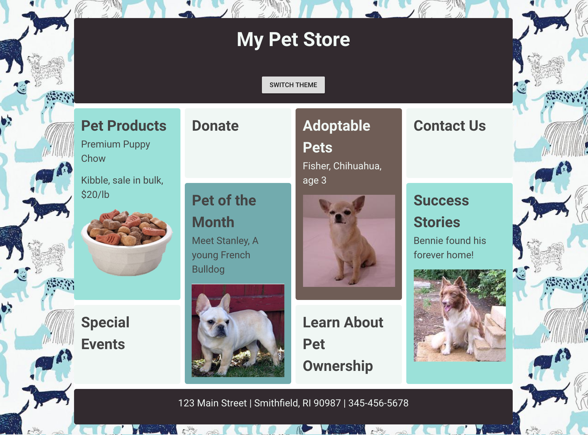
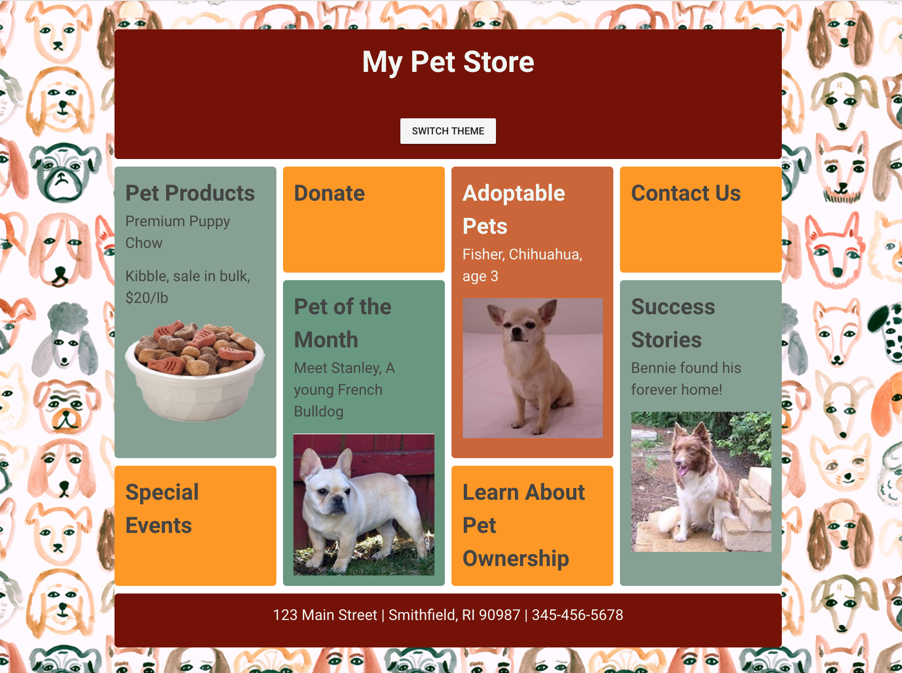

# 📋 Chapter 1: Introducing the My Pet Shop web site

| **Project Goal**            | Get started with Vue.js by creating a static Pet Shop web site                                                                                                                                   |
| --------------------------- | ------------------------------------------------------------------------------------------------------------------------------------------------------------------------------------------------ |
| **What you’ll learn**       | Setting up your Vue app, CSS Grid, Styling in Vue, code structure in preparation for moving forward.                                                                                             |
| **Tools you’ll need**       | A modern browser like Chrome. If using Chrome, download Chrome DevTools for Vue.js. An account in CodeSandbox.io. |
| **Time needed to complete** | 1/2 hour                                                                                                                                                                                         |

# Instructions

Since this is the very first Vue.js web project we're going to make, we'll start from scratch in [Code Sandbox](http://codesandbox.io). Create a Code Sandbox account and scaffold a starter Vue.js template by clicking [here](https://codesandbox.io/s/vue).

//1. Start [here](https://codesandbox.io/s/3x309k44op)

We're going to build a storefront for a fictional Pet Shop that will look like this:



In addition, we're going to create a switch that will change the look of the shop to resemble this:



Take a look at the code that was scaffolded by Code Sandbox for a basic Vue.js app. The first file you'll see is open by default: `main.js`. This is the main starting point of a Vue.js app. Note that in this file you import Vue from its npm package: `import Vue from "vue";`. Code Sandbox imports all the needed dependencies from npm to build the app; you can always check out the root `package.json` to find out which dependencies are needed.

`main.js` also initializes the app as a new Vue.js app and sets the div into which the app code will be injected. It also names the main component and sets the template's name:

```
new Vue({
  el: "#app",
  components: { App },
  template: "<App/>"
});
```

Open up `App.vue`. In this file, the 'home' component is built. It contains the three main parts of a Vue.js Single File Component (SFC): a template, a script block, and a style block. 

Note the first div in the template block has the id of 'app' - this is the div where the app code will be injected. There's also a `<HelloWorld>` component included underneath the logo image. This is an example of an SFC being included into `App.vue`.

Open `/components/HelloWorld.vue` and you'll find the source of the list of links that appears embedded in `App.vue`. This file also includes a script block with a `msg` variable and some more styles in a `<style>` block.

We're going to rip this sample app apart and recreate it! Let's get started.

1. build main.js
2. build App.vue
3. embed a component


3. You might see the `orange-green` class in stylesheet. Let's add it to the `<main>` element and observe how all the colors & background are changed:
    ```
    <main class="orange-green">
    ```
4. Now let's try to change the class using Vue class bindings. Replace simple class in `<main>` with dynamic class binding: `:class="{'orange-green': false}"`. Try to change `false` to `true` and vice versa. You can see how class is applied in Chrome dev tools and how the page color theme is changing.
5. It's time to create your first Vue variable. First, you have to add `data()` to your Vue component. This dfunction  should return an object of our Vue variables. Let's create one:
    ```
    data() {
        return {
          themeSwitched: false
        };
      }
      ```
      So, now ve have a variable called `themeSwitched` and it's default value is `false`.
6. In our `<main>` replace `false` in class binding with our newly created variable. Now we have
   ```
    <main :class="{'orange-green': themeSwitched}">
    ```
7. Let's try to change `themeSwitched` value inside `data` from `false` to `true`. Again, you can see the color change effect.
8. Now we only need a switch to change a theme. First we will create a button (we're using Vuetify so ot will be a Vuetify button component). Let's place it in the `header` right after `h1` tag:
    ```
    <header class="app-header dark-brown">
        <h1>My Pet Store</h1>
        <v-btn>Switch theme</v-btn>
      </header>
      ```
9. Now let's add a click event handler to our button. We can use `v-on` directive or its shortcut `@`. This handler will change `themeSwitched` value to opposite, toggling the color-changing class.
    ```
    <v-btn @click="themeSwitched = !themeSwitched">Switch theme</v-btn>
    ```
10. Congratulations! You've just finished Chapter 1!


# Final result


